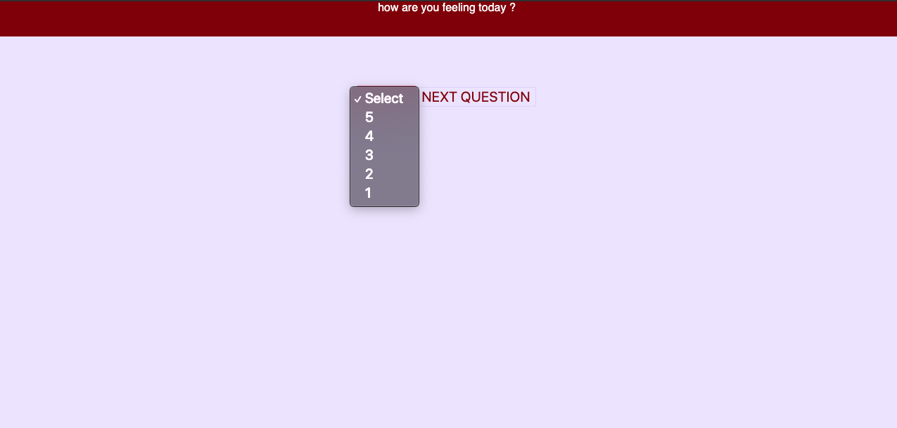

## Description
*Duration: 3 days*
FEEDBACK LOOP is an application where users can answer a select number of question based on feedback. by using redux this application can run on an infinate loop.
 
## Screen Shot

## Prerequisites
-none
 
 
## Installation
Installation
-make a database with the name of prime_feedback, make a table using data.sql and insert data into the tables. 
 -Clone this repository and run NPM install 
 -run npm run server/ npm run client once the repository is downloaded.

 
 
## Built With
-html5 
-css
-react
-redux
axios
-PostgreSQL
-Node.js
-Express.js
